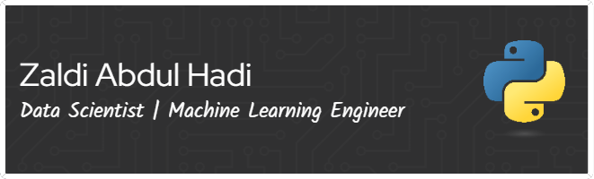

🔭 I’m currently working on my personal project  
🌱 I’m currently learning Machine Learning with a focus on Data Classification and Text Classification 
💬 Ask me about anything related! Happy to chat on my DMs.

<h3>Languages and tools</h3>

  

 

          

###

  <h3>Connect with me</h3>
  
  
  

### Curently Listening

